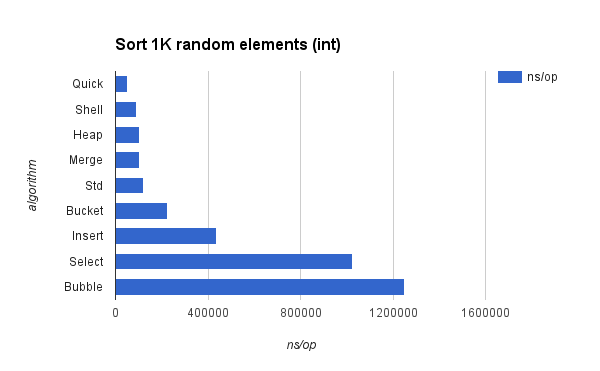

# Sort

The followings are benchmarking result.

| name | times | ns/op | B/op | allocs/op |
| :---: | ---: | ---: | ---: | ---: |
|BenchmarkSort1K/Quick-4|30000|53654|0|0|
|BenchmarkSort1K/Shell-4|20000|89352|0|0|
|BenchmarkSort1K/Merge-4|10000|103946|81920|1023|
|BenchmarkSort1K/Heap-4|10000|102479|0|0|
|BenchmarkSort1K/Bucket-4|10000|224558|36757|781|
|BenchmarkSort1K/Std-4|10000|122410|32|1|
|BenchmarkSort1K/Insert-4|3000|437806|0|0|
|BenchmarkSort1K/Select-4|2000|1025890|0|0|
|BenchmarkSort1K/Bubble-4|2000|1249174|0|0|




[https://docs.google.com/spreadsheets/d/1cdkryOQ8jA0TcfHctMHHLvXWGEMU86kDs4EPhnQuebk](https://docs.google.com/spreadsheets/d/1cdkryOQ8jA0TcfHctMHHLvXWGEMU86kDs4EPhnQuebk/edit?usp=sharing)

## Tips

To compare performance use [`benchcmp`](https://godoc.org/golang.org/x/tools/cmd/benchcmp)

```bash
$ go get golang.org/x/tools/cmd/benchcmp
$ go test -bench . -benchmem -cpuprofile cpu.prof > old.txt
$ go test -bench . -bemchmem -cpuprofile cpu.prof > new.txt
$ benchcmp old.txt new.txt
```

To visualize cmp,

```bash
$ go get github.com/ajstarks/svgo/benchviz
$ benchcmp old.txt new.txt | benchviz > output.svg
```

To check cpu profile,

```bash
$ go test -bench . -benchmem -cpuprofile cpu.prof
$ go tool pprof sort.test cpu.prof
```

(Why `sort.test` is required ? To find simbol localtion)

To check memory allocation,

```bash
$ go test -bench . -benchmem -memprofile mem.prof
$ go tool pprof -alloc_objects sort.test mem.prof
```

To generate markdown table,

```bash
$ go get github.com/tcnksm/misc/cmd/benchtable
$ go test -bench . -benchmem | benchtable
```
